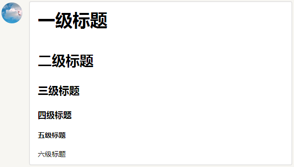

### 用 Markdown 来记笔记
Markdown 跟 HTML 一样，是一种标签语言。但是 Markdown 语法特别简单，适合用来做笔记.

#### 常用的语法参考

什么是Markdown语法？

>Markdown 是一种轻量级标记语言，目标是实现「易读易写」。Coding.net的许多版块都采用了Markdown语法，比如冒泡，讨论，Pull Request等。

#### 标题

>在Markdown中，你只需要在文本前面加上# 即可，同理、你还可以增加二级标题、三级标题、四级标题、五级标题和六级标题，总共六级，只需要增加# 即可，标题字号相应降低。例如：

# 一级标题
## 二级标题
### 三级标题
#### 四级标题
##### 五级标题
###### 六级标题
点击预览可以看到效果：

在这里输入图片描述



#### 引用的区块内也可以使用其他的 Markdown 语法，包括标题、列表、代码区块等：
```js
> ## 这是一个标题。
>
> 1. 这是第一行列表项。
> 2. 这是第二行列表项。
>
> 给出一些例子代码：
>
> return shell_exec("echo $input | $markdown_script");

```

在这里显示上面的描述：
> ## 这是一个标题。
>
> 1. 这是第一行列表项。
> 2. 这是第二行列表项。
>
> 给出一些例子代码：
>
> return shell_exec("echo $input | $markdown_script");


####无序列表：使用星号、加号或是减号作为列表标记
```js
- Red
- Green
- Blue

* Red
* Green
* Blue
```

上面的代码显示以下格式：
- Red
- Green
- Blue


* Red
* Green
* Blue


#### 有序列表：使用数字接着一个英文句点
```js
1. Red
2. Green
3. Blue
```
上面的代码显示以下格式：
1. Red
2. Green
3. Blue

#### 代办列表: 表示列表是否勾选状态
```js
- [ ] 不勾选
- [x] 勾选
```

上面的代码显示以下格式：
- [ ] 不勾选
- [x] 勾选


#### 强调
```js
*Coding，让开发更简单*
_Coding，让开发更简单_
```
上面的代码显示以下格式：
*Coding，让开发更简单*
_Coding，让开发更简单_


#### 加粗
```js
**Coding，让开发更简单**
__Coding，让开发更简单__
```

上面的代码显示以下格式：
**Coding，让开发更简单**
__Coding，让开发更简单__


#### 自动链接

方括号显示说明，圆括号内显示网址， Markdown 会自动把它转成链接，例如：
```js
[超强大的云开发平台Coding](http://coding.net)
```


上面的代码显示以下格式：
[超强大的云开发平台Coding](http://coding.net)


#### 在 Markdown 中，可以制作表格，例如：


First Header | Second Header | Third Header
------------ | ------------- | ------------
Content Cell | Content Cell  | Content Cell
Content Cell | Content Cell  | Content Cell


上面的代码显示以下格式：

```
First Header | Second Header | Third Header
------------ | ------------- | ------------
Content Cell | Content Cell  | Content Cell
Content Cell | Content Cell  | Content Cell
```


#### 在 Markdown 中，可以制作分割线，例如：
```js
-----------
```

上面的代码显示以下格式：
----------------


#### 图片

```js

```

上面的代码显示以下格式：


##  具体内容
那么 Github 就提供了这个编译环境。到 Github 上我们的项目中，有一个文件叫 README.md 这里 md 就是 markdown 的缩写。
在这个文件里面，我们去写 markdown ，就可以翻译成 html 。

```js
[百度](http://baidu.com)

<a href="http://baidu.com">百度</a>
```


#### Mardown 中添加语法高亮

什么是语法高亮？ 如果一段代码没有语法高亮，那么就是所有的字符都显示成一个颜色。但是通常编辑器中有语法高亮，也就是不同语法作用的字符串会显示成不同的颜色。

markdown 中，如果写成下面这样，最终显示的效果就是有语法高亮的：


```js
console.log('hello');
console.log('hello');

```


```css
body {
  background: red;
}
```


### 终于开始用使用 Gitbook 来做笔记了

根据官网说明 第一步，先安装
```js
npm install gitbook-cli -g
```


然后，创建一个笔记文件夹

```js
mkdir my-note
```

然后执行

```js
cd my-note
gitbook init
```
这样，可以生成两个文件

- README.md 的内容会显示在书皮上
- SUMMARY.md 是目录


启动服务器，查看和编辑书籍

```js
gitbook serve
```

这样，可以启动一个服务器，然后到 localhost:4000 端口，就可以看到这本书了。

可以修改 SUMMARY.md 来添加书籍目录


```js
# Summary

* [Introduction](README.md)
* [第一章：redux](./redux/index.md)
  * [第一节：state 复习](./redux/1-state.md)
  * [第二节：你好 redux](./redux/2-hello-redux.md)
  ```

  下一步，创建笔记文件，atom 到 redux 文件夹中创建 1-state.md 和 2-hello-redux.md 文件。


  保存书稿到 github 仓库

  首先到 github.com 上创建 my-note 仓库。

  运行 gitbook serve 命令之后，生成临时文件夹 _book 这个不是我们写的，所以一定要放到 .gitignore 文件中，所以，我们就在 my-note 文件夹的顶级位置，创建 .gitignore 文件，内容如下


  > 接下来我们想做的事情是：把书稿上传到 github.com/weihui-note 这个仓库的 master 分支保存起来。具体步骤是：

  ```js
  cd my-note
git init
git add -A
git commit -m"msg"
git remote add origin git@github.com:happypeter/peter-note.git
git push -u origin master
```


### 添加自动化脚本
上面的操作之后，如果我们再去运行：
```js
gitbook serve
```

就会报错，因为文件找不着了。需要把命令改一下
```js
gitbook serve ./content ./gh-pages
```

这样，我们就又可以启动成功了，同时，也会自动创建 gh-pages 文件夹，文件夹中的内容，就是编译后的输出。

每次启动的时候，都要敲长长的命令，很不方便，所以，我们就需要把命名简短化，具体就是去写成 npm 脚本。具体步骤如下：

第一步，把项目变成一个 nodejs 的项目：

```js
cd my-note
npm init -y
```

然后，package.json 中添加这些代码：
```js
"scripts": {
 "start": "gitbook serve ./content ./gh-pages"
},
```
有了上面的 npm 脚本之后，我们如果我想在本地 4000 端口查看本书，只需要运行

```js
npm start
```
就可以成功预览了。

注意，此时多个一个文件夹 gh-pages，这个文件夹中的内容，也不是我们自己写的，所以到 .gitignore 文件里面添加

```js
gh-pages
```

然后再进行 git 做版本的操作。
```js
git 版本的操作
```


部署书籍到 gh-pages
这一步，可以手动做：

- 第一步：编译项目，来把 md 文件翻译成 html 放到 gh-pages 文件夹
- 第二步，拷贝 gh-pages 中的所有文件，到本仓库的 gh-pages 分支，然后上传
- 第三步，以后每次修改完都需要拷贝到 gh-pages 分支，很麻烦
所以，我们采用一个 npm 包，来帮助我们完成上面的操作


```js
cd my-note/
npm i --save gh-pages
```


然后创建 my-note/scripts/deploy-gh-pages.js
里面的内容是：

```js
'use strict';

var ghpages = require('gh-pages');

main();

function main() {
    ghpages.publish('./gh-pages', console.error.bind(console));
}
```
上面的脚本的作用，就是把当前文件夹下的 gh-pages 文件夹中的所有内容，push 到本仓库的 gh-pages 分支。

然后添加一个 npm 脚本 deploy （ deploy 就是部署的意思），如下：

```js
"scripts": {
 "start": "gitbook serve ./content ./gh-pages",
 "deploy": "node ./scripts/deploy-gh-pages.js",
},
```

那么，可以来试试，保证 npm start 处于运行中的状态，然后运行
```js
npm run deploy
```
